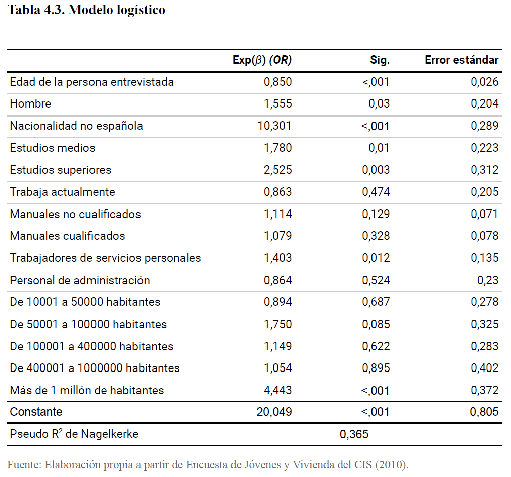

# 📁 Proyectos

Aquí puedes explorar algunos de los proyectos en los que he trabajado, con enlaces a repositorios y descripciones.

## 📚 Índice de proyectos

- [Trabajo de Fin de Grado: El alquiler como estrategia de emancipación residencial de los jóvenes](#trabajo-de-fin-de-grado-el-alquiler-como-estrategia-de-emancipacion-residencial-de-los-jovenes)
- [Otro proyecto](#otro-proyecto)

---

## Trabajo de Fin de Grado: El alquiler como estrategia de emancipación residencial de los jóvenes

Para mi Trabajo de Fin de Grado, desarrollé una investigación basada en el análisis de datos cuantitativos utilizando SPSS. Este proyecto aborda el fenómeno del **aumento del alquiler entre las personas jóvenes**, utilizando los datos de la **Encuesta Jóvenes y Vivienda**, elaborada por el Centro de Investigaciones Sociológicas (CIS).

En primer lugar, realicé un **análisis descriptivo** para examinar la prevalencia del alquiler juvenil y las condiciones asociadas, como la cuantía, localización y características residenciales. A continuación, llevé a cabo una **regresión logística binaria** con el fin de explorar cómo distintas variables —como el género, la nacionalidad o el nivel de estudios— influyen en la probabilidad de que una persona joven emancipada resida en régimen de propiedad o de alquiler.

En el repositorio se encuentra la sintaxis en SPSS que utilicé para llevar a cabo el proceso de limpieza de la base de datos y los análisis realizados.

<strong>Más detalles y resultados</strong>

<strong>Resultados</strong>:

Se encuentra que la prevalencia de alquiler es alta entre la juventud analizada. Las condiciones de alquiler varían según el contexto residencial (cuantía, localización, etc.).

En la regresión logística, destacan como variables significativas el <strong>nivel educativo</strong>, el <strong>género</strong> y la <strong>nacionalidad</strong>.

👉 [Ver repositorio en GitHub](https://github.com/aliciatm/Sintaxis-TFG-alquiler-jovenes)

## Otro proyecto

Haz clic para ver más

Aquí va el texto con detalles, resultados, imágenes, etc.

